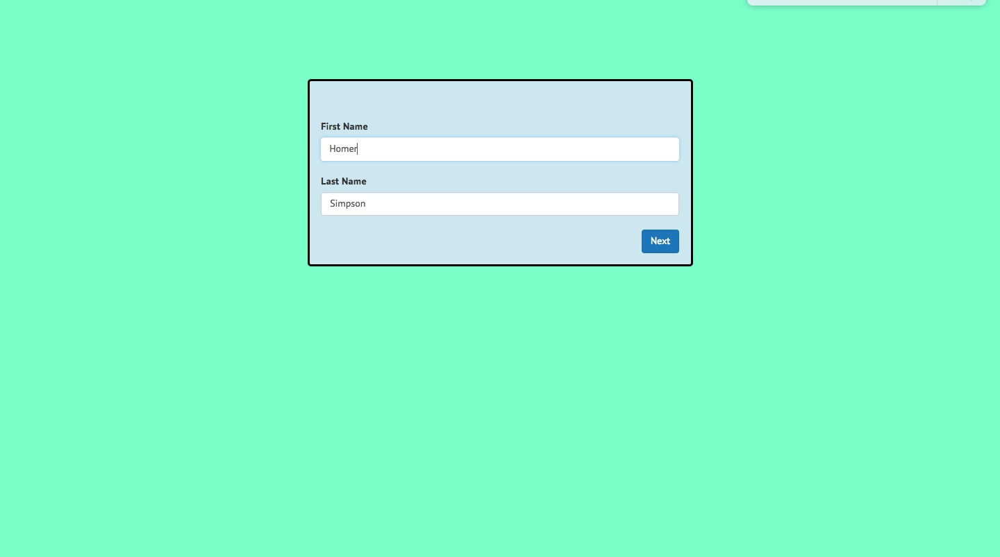

# README

[Live link][heroku]

[heroku]: http://celmatix-cc.herokuapp.com

### Overview

A simple "wizard sign-up form" built on React, Ruby on Rails, and PostgreSQL.

### Get Started

1. Install dependencies by running `npm install` followed by `bundle install`.
2. PostgreSQL was my db of choice. Start your database by running `bundle exec rake db:setup`.
3. Start your server by running `bundle exec rails server` and opening `localhost:3000` in your browser.
4. Start webpack by running `webpack --watch`
5. Run tests with `bundle exec rspec spec`.

### Technologies

1. This form is built on React and Rails. I decided to use vanilla React to see what issues would arise without the benefit of Redux's universal store to hold state. Additional front-end dependencies include babel, and react-bootstrap.

The backend utilizes Rails and PostgreSQL - per requirement. The gems used include: `better_errors`, `binding_of_caller`, `should-matchers`, and `annotate`.

### Architecture

#### Back-end
The schema consists of just a Users table. 

<table>
  <tr>
    <td>id</td>
    <td>fname</td>
    <td>lname</td>
    <td>email</td>
    <td>age</td>
    <td>height</td>
    <td>weight</td>
    <td>color</td>
  </tr>
  <tr>
    <td>1</td>
    <td>"Homer"</td>
    <td>"Simpson"</td>
    <td>"MrPlow@gmail.com"</td>
    <td>"36 - 45"</td>
    <td>"6'0"</td>
    <td>315</td>
    <td>"Pink"</td>
  </tr>
  <tr>
    <td>2</td>
    <td>"Charles Montgomery"</td>
    <td>"Burns"</td>
    <td>"MrBurns@gmail.com"</td>
    <td>"46 or older"</td>
    <td>"5'11"</td>
    <td>NULL</td>
    <td>"Green"</td>
  </tr>
</table>

#### Front-end

The spreadsheet is made of six components, AuthForm (parent) and NameForm, EmailForm, BioForm, ColorForm, FinishPage (children). AuthForm holds the state, passing down the necessary props such as functions or HTML elements (buttons).

The state is cached everytime the state is updated. When the component mounts, and the cache exists, the state is fetched and set via setState.

Validations are sent to the backend and are tied the "Next" button. The promise either helps to render errors or calls a function to turn the page (this.state.page + 1). The "Prev" button is simply a callback.

### Dev-Related Issues

#### Things I would've done different

1. Use ONLY RESTful routes. I recreated a custom route specific for validations, but after doing some additiional reading - I should've avoided it. I might've been able to use just my create method and do the validations there.

2. Refactor my validations heavily. I would've set up my front-end to send param names that matched exactly the columns in my database (so not use bio). I would then be able to interpolate into `user.errors.messages[interpolate_here]` and grab the necessary errors.

3. Definitely spend less time on my front-end because it took away time from refactoring my controller. I was overzealous - you live, you learn.

#### Things I learned

1. Caching! It's pretty cool, and fairly simple and straightforward with localStorage.

2. Writing custom routes

3. How to use REGEX to help validate. After doing some research, I considered the following regex for email validations should be "/.+@.+\..+/i". "http://www.aidanf.net/posts/validating-emails-in-rails"

4. The logic behind using HTML/CSS elements such as radio buttons and readOnly inputs in React.

#### Questions I came across when building this app:

Back-end Architecture

I was unsure if I wanted to:
1. Create the height in the front-end. My front-end state has feet, inches, and height. I could've sent down just feet and inches as params and created the height in the back-end.
2. If I should've sent something up to confirm a validation was okay. Currently, if the input's are valid, it does it silently.
3. Used a name validation using REGEX instead of implementing a private method

Front-end Architecture

I was unsure if I wanted to:
1. Use GET or POST when sending data to be validated. It's not really a GET request, because I need to send data to be verified. However, it's not a POST request either because I'm not writing to the database. In the end, I opted to use a POST request because although, I'm not writing to a database, convention says that GET requests should never have a payload. Therefore, it was the lesser of two evils.

Repo URL: https://github.com/Lookatamonkey/celmatix